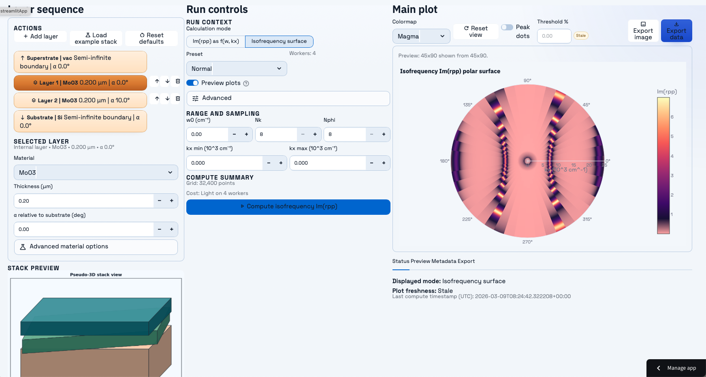

# Multilayer Anisotropic Transfer Matrix

A scientific Streamlit application for building multilayer optical stacks, assigning anisotropic material models, and exploring `Im(rpp)` dispersion and isofrequency maps with a pyGTM-based transfer-matrix solver.

Live app: <https://multilayeranisotropictransfermatrix-ev.streamlit.app>



## Scientific context

This repository packages a research-oriented interface around an anisotropic transfer-matrix workflow for stratified media. The app is intended for rapid exploration of multilayer stacks with rotated anisotropic layers, semi-infinite boundary media, and optional Drude terms for free-carrier contributions.

The implementation is based on the generalized 4×4 formalism described by Passler and Paarmann and uses `pyGTM` as the numerical backend for the underlying electromagnetic system matrices.

## Main features

- Build multilayer stacks from superstrate to substrate in a dedicated stack editor
- Edit material, thickness, in-plane angle, and optional full Euler angles
- Add optional Drude terms to any layer, including boundary media
- Compute `Im(rpp)` maps as a function of `(w, kx)`
- Compute isofrequency polar maps as a function of `(phi, kx)`
- Preview the stack geometry in a compact pseudo-3D scientific view
- Export computed data and publication-friendly plot images

## Installation

Create a Python environment and install the dependencies:

```bash
python3 -m venv .venv
source .venv/bin/activate
pip install -r requirements.txt
```

The repository also supports editable installation:

```bash
pip install -e .
```

## Quick start

Run the application with Streamlit:

```bash
streamlit run app.py
```

The app is designed to work directly from a fresh clone. The root `app.py` adds the local `src/` directory to `sys.path`, so installation is not required to launch the Streamlit interface after dependencies are installed.

If you only want to use the public deployment, open:

<https://multilayeranisotropictransfermatrix-ev.streamlit.app>

## Example usage

1. Start the app with `streamlit run app.py`
2. Load the built-in example stack from the stack builder panel
3. Adjust layer material, thickness, orientation, or Drude term
4. Choose either dispersion or isofrequency mode
5. Set the frequency and momentum sampling ranges
6. Run the computation and inspect the plot
7. Export the resulting data or plot image

## Built-in presets

Two kinds of presets are included in the public release:

- Speed presets: `Coarse`, `Normal`, and `Fine`
- Stack presets: a default boundary-only stack and a small example stack for immediate testing

The speed presets live in [`src/multilayer_atm/presets.py`](src/multilayer_atm/presets.py). The example stack can be loaded directly from the UI and serves as a reproducible minimal starting point for new users.

## Project structure

```text
.
├── app.py
├── assets/
│   └── figures/
├── src/
│   └── multilayer_atm/
│       ├── app.py
│       ├── presets.py
│       ├── materials.py
│       ├── models.py
│       ├── plotting.py
│       ├── solver.py
│       └── ui/
├── .streamlit/
│   └── config.toml
├── README.md
├── requirements.txt
├── pyproject.toml
├── CITATION.cff
└── LICENSE
```

## Dependencies

Runtime dependencies are declared in both `requirements.txt` and `pyproject.toml`:

- `streamlit`
- `numpy`
- `scipy`
- `matplotlib`
- `plotly`
- `pyGTM`

## Original code and references

This public repository packages and cleans up a scientific codebase built around the original anisotropic transfer-matrix workflow and `pyGTM`-based material/system handling. Please also credit the upstream scientific and software work when using this project:

- N. C. Passler and A. Paarmann, *Journal of the Optical Society of America B* **34**, 2128 (2017), DOI: [10.1364/JOSAB.34.002128](https://doi.org/10.1364/JOSAB.34.002128)
- `pyGTM` repository: <https://github.com/pyMatJ/pyGTM>

## Citation

If you use this repository in academic work, please cite:

- this software repository
- the Passler and Paarmann publication above
- the `pyGTM` project when relevant

Citation metadata is provided in [`CITATION.cff`](CITATION.cff).

## Author

Edoardo Vicentini  
CIC nanoGUNE

## License

This project is distributed under the MIT License. See [`LICENSE`](LICENSE).
