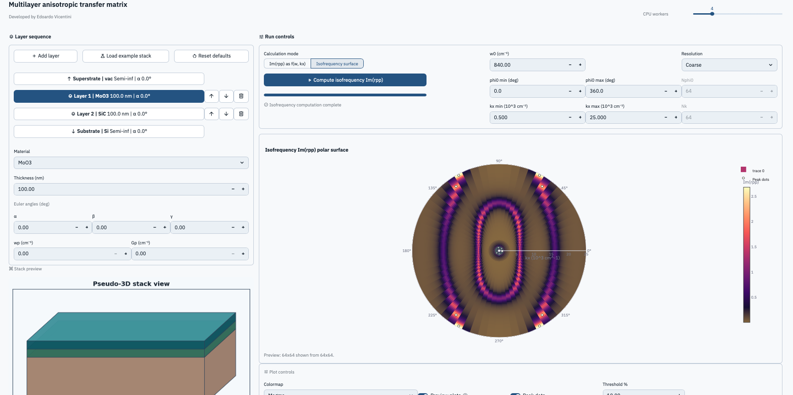

# Multilayer Anisotropic Transfer Matrix

A Python package and Streamlit app for calculating optical reflection from anisotropic, layered media. Build a stack, explore its dispersion and isofrequency response, and export the results. The solver uses an in-house implementation of the generalized 4 × 4 transfer-matrix formalism.

- **Live app:** [multilayeranisotropictransfermatrix-ev.streamlit.app](https://multilayeranisotropictransfermatrix-ev.streamlit.app)
- **Repository:** [github.com/vicentini-edoardo/Multilayer_anisotropic_Transfer_Matrix](https://github.com/vicentini-edoardo/Multilayer_anisotropic_Transfer_Matrix)



## What it can do

- Model a stack with semi-infinite superstrate and substrate and any number of internal layers.
- Calculate the p-polarized reflection response, `Im(rpp)`, across wavenumber and in-plane wavevector or across in-plane angle and wavevector at a fixed wavenumber.
- Use built-in material models or define custom isotropic and diagonal-anisotropic materials with Lorentz oscillators or tabulated permittivity.
- Add an optional Drude contribution to a layer.
- View the stack and results in the app; download result data and plot images.
- Reconstruct a normalized near-field intensity map for a vertical dipole from a full 360° isofrequency calculation.

## Install and run the app

Python 3.11 or newer is required.

```bash
git clone https://github.com/vicentini-edoardo/Multilayer_anisotropic_Transfer_Matrix.git
cd Multilayer_anisotropic_Transfer_Matrix
python -m pip install -e .
python -m streamlit run app.py
```

The editable install includes the dependencies declared in `pyproject.toml`, including the pinned [Materials Library](https://github.com/vicentini-edoardo/Materials_Library) revision used for built-in material definitions. Alternatively, install dependencies from `requirements.txt` and launch from the repository root.

## Use the app

1. Load the example stack or build one in the layer panel. The first and last entries are the semi-infinite superstrate and substrate; entries between them are finite layers.
2. Choose a material and set each layer's thickness and orientation. Add a Drude term or define a custom material if needed.
3. Choose a dispersion map, `Im(rpp)(w, kx)`, or an isofrequency map, `Im(rpp)(phi, kx)`, then set the sampling range and resolution.
4. Run the calculation, inspect the plot, and use the export controls to download data or a PNG image.

For the vertical-dipole field map, run a full 360° isofrequency sweep and retain the complex `rpp` samples (the app does this automatically). The reconstruction requires an isotropic, lossless dielectric superstrate, such as air. It includes evanescent background and is a normalized field-intensity proxy, not absolute power or energy flux. Results depend on the sampled momentum band and grid; increase the momentum and angular sampling and FFT size to check convergence. A finite band can produce ringing and periodic FFT artifacts.

## Use the Python API

The package exports stack models, material helpers, and two map calculations. The example below calculates a dispersion map for a 100 nm SiC layer between vacuum and silicon:

```python
from multilayer_atm import LayerSpec, StackSpec, compute_isofreq_map, compute_rpp_map

stack = StackSpec.from_layers([
    LayerSpec("vacuum", 0.0),
    LayerSpec("SiC3C", 100e-9),
    LayerSpec("Si", 0.0),
])

w_cm1, kx_cm1, im_rpp = compute_rpp_map(
    stack,
    w_min=700, w_max=1100, nw=160,
    kx_min=0, kx_max=5000, nk=180,
    workers=1,
)
```

All wavenumber and in-plane wavevector inputs use cm⁻¹. `w_cm1` and `kx_cm1` are one-dimensional arrays; `im_rpp` has shape `(nw, nk)`. For an isofrequency calculation, call `compute_isofreq_map(stack, w0, kx_min, kx_max, nk, nphi)`. It returns angle in radians, wavevector in cm⁻¹, and `Im(rpp)` with shape `(nphi, nk)`. Set `return_complex=True` to return complex reflection samples instead. Set `workers` to control process parallelism; `fast=True` selects the vectorized solver.

Layer Euler angles are supplied in degrees as `euler_deg=(alpha, beta, gamma)`. Thickness is in metres. The first and last layers are treated as semi-infinite boundaries regardless of their thickness values. See the exported names in [`src/multilayer_atm/__init__.py`](src/multilayer_atm/__init__.py) and function signatures in [`src/multilayer_atm/solver.py`](src/multilayer_atm/solver.py).

## Model scope

The solver handles isotropic, uniaxial, and biaxial materials represented by diagonal permittivity in their principal-axis frame, with layer orientation applied through Euler rotations. It does not model off-diagonal permittivity in the material's principal-axis frame. Built-in materials are provided by the linked Materials Library; custom materials can be defined in the app and exported or imported as JSON. Tabulated custom permittivity is linearly interpolated and held at the endpoint values outside the table's frequency range.

The displayed stack sketch is schematic. The vertical-dipole map is a post-processing estimate based on sampled isofrequency data; it does not perform mode or pole extraction. Refine sampling when narrow resonances or quantitative convergence matter.

## Scientific reference and citation

The transfer-matrix formalism follows:

N. C. Passler and A. Paarmann, “Generalized 4 × 4 matrix formalism for light propagation in anisotropic stratified media: study of surface phonon polaritons in polar dielectric heterostructures,” *Journal of the Optical Society of America B* **34**(10), 2128 (2017). [doi:10.1364/JOSAB.34.002128](https://doi.org/10.1364/JOSAB.34.002128).

If you use this software in research, cite the paper and this repository. Repository citation metadata is in [`CITATION.cff`](CITATION.cff).

## License

This repository's source code is distributed under the MIT License; see [`LICENSE`](LICENSE). The built-in material catalog is maintained separately in the [Materials Library](https://github.com/vicentini-edoardo/Materials_Library).
